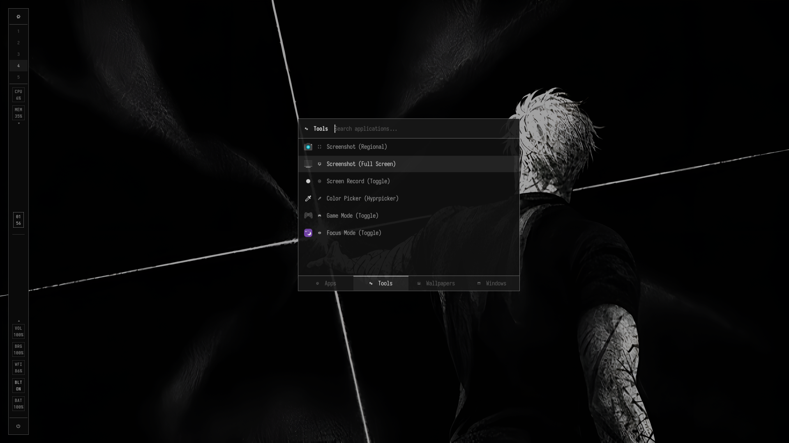
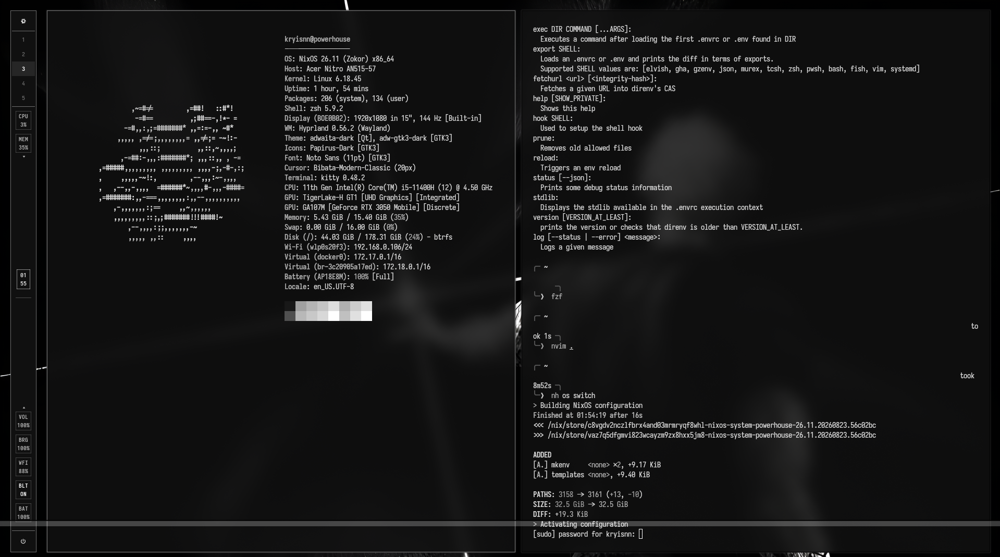

<p align="center">
  <strong>F L I N T</strong>
  <br>
  <em>Deterministic NixOS configuration — one flake to rule them all.</em>
</p>

---





---

## What is this?

Flint is my personal NixOS configuration. It manages everything from kernel parameters to Neovim keybindings in a single, reproducible flake. Drop a new host file in `hosts/`, set a few options, and `nh os switch` gives you the whole stack.

> [!NOTE]
> Built on [flake-parts](https://github.com/hercules-ci/flake-parts) + [import-tree](https://github.com/denful/import-tree). Modules are discovered automatically — no manual import lists.

---

## Stack

| Layer | What's in it |
|:------|:-------------|
| **Desktop** | Hyprland (Wayland), UWSM, Waybar, Rofi, Dunst, Hyprlock, Swww wallpapers |
| **Shell** | Zsh + Vi mode, Starship prompt, fzf, bat, eza, fd, ripgrep, zoxide |
| **Editor** | Nixvim (LazyVim workflow) — Gruvbox, Snacks.nvim, Flash, Trouble, LSP |
| **Dev** | Tiered tooling (`min` → `mid` → `max`), direnv + nix-direnv, `mkenv` bootstrapper |
| **System** | Declarative hardware (Intel/AMD × Nvidia/AMD), PipeWire, Docker, Quad9 DNS |
| **Gaming** | Steam, Gamescope, MangoHud, GameMode |

---

## Dev Tiers

Set `dev = "min"` / `"mid"` / `"max"` / `"off"` per host. Each tier inherits from the one below.

```
off → nothing
min → git, gcc, neovim, direnv, mkenv, lazygit
mid → min + go, node, python, pnpm, zed, docker tools, AI IDEs
max → mid + flutter, godot, blender, android-tools, uv
```

> [!TIP]
> `mkenv` bootstraps per-project `flake.nix` + `.envrc` environments instantly.
> Run `mkenv ts` for TypeScript, `mkenv go` for Go, `mkenv py` for Python — or just `mkenv` for a fuzzy picker.

---

## Hardware Abstraction

```nix
var = {
  cpu = "intel";       # or "amd"
  gpu = "nvidia";      # or "amd" / "intel"
  nvidia.mode = "sync"; # or "offload" / "desktop"
};
```

That's it. Microcode, drivers, VA-API, PRIME offload — all wired automatically.

---

## Structure

```
flint/
├── flake.nix              # Entrypoint
├── hosts/
│   ├── powerhouse/        # My machine
│   └── template/          # Copy this to add a new host
└── modules/
    ├── home/
    │   ├── desktop/       # Hyprland, Waybar, Dunst, Swww, etc.
    │   ├── dev/           # Dev tiers, Nixvim, mkenv + templates
    │   ├── entertainment/ # Gaming, social apps
    │   ├── productivity/  # TUI/GUI productivity tools
    │   ├── shell/         # Zsh, Starship, CLI tools
    │   └── home.nix       # XDG compliance & base config
    └── system/
        ├── base.nix       # Kernel, PipeWire, Docker, DNS
        ├── desktop.nix    # Hyprland session, fonts, display manager
        ├── hardware.nix   # CPU/GPU declarative abstraction
        ├── gaming.nix     # Steam, GameMode
        └── utils.nix      # System-wide utilities
```

> [!IMPORTANT]
> All modules are auto-imported via `import-tree`. You never need to manually add imports to `flake.nix` — just create a `.nix` file in the right directory.

---

## Quick Start

**Rebuild:**
```bash
nh os switch
```

**Lint & format:**
```bash
alejandra .          # format
deadnix .            # find dead code
statix check .       # anti-patterns
```

**Bootstrap a dev environment:**
```bash
mkenv rust my-project
cd my-project        # direnv activates automatically
```

---

## Adding a New Host

```bash
cp -r hosts/template hosts/my-machine
```

Edit `hosts/my-machine/default.nix` — set hostname, timezone, user, hardware vars, and which modules to import. Generate `_hardware.nix` with `nixos-generate-config`.

> [!CAUTION]
> Don't forget to update disk UUIDs in `_hardware.nix` — they're unique to each machine.

---

## Offline Install

Flint supports fully offline installation via Nix closure archives. Build on a connected machine, export to USB, import on target.

See [docs/offline-installation.md](docs/offline-installation.md) for the full guide.

---

## Docs

- [Architecture & Module Structure](docs/architecture.md)
- [Offline Installation Guide](docs/offline-installation.md)

---

<sub>NixOS unstable · flake-parts · home-manager · nixvim · hyprland</sub>
